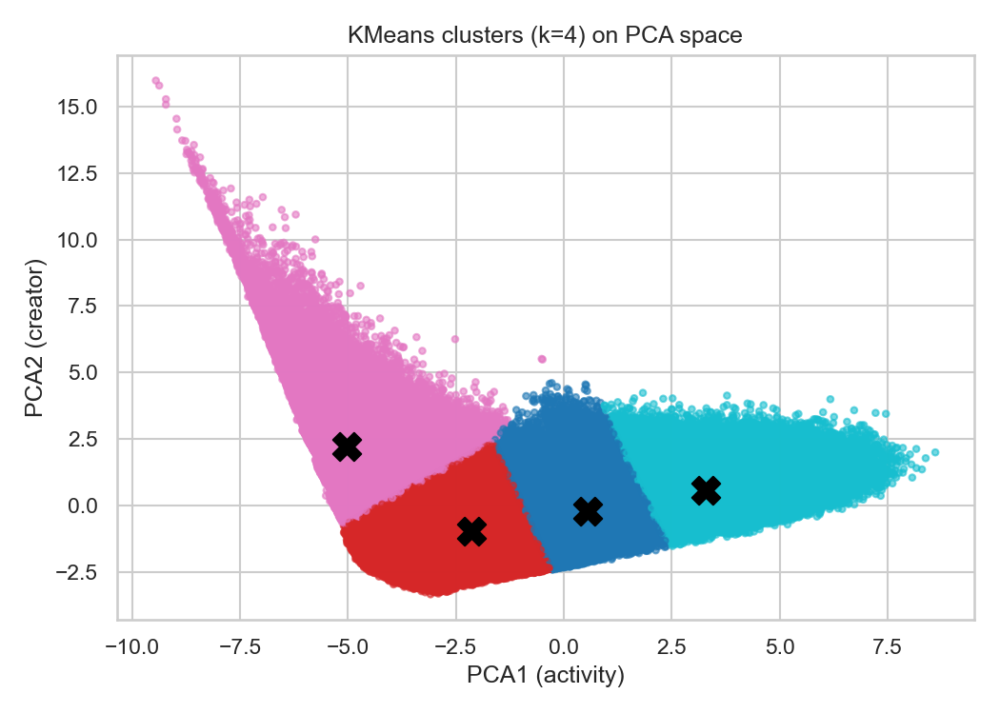

# Instagram User Segmentation

Instagram User Segmentation is an exploratory data science project that analyzes user activity patterns using Python, feature engineering, PCA, and K-Means clustering. The pipeline identifies four descriptive usage profiles and compares their income distributions while explicitly accounting for the limitations of unsupervised segmentation.

## Objective

Explore whether users can be grouped meaningfully by Instagram usage intensity
and content creation. The project does not predict income or measure the effect
of segmentation on revenue, retention, or advertising campaigns.

## Data

- File: `data/raw/instagram_usage_lifestyle.csv`.
- Size: **1,547,896 rows and 58 columns**.
- Features: demographics, lifestyle, in-app activity, and account settings.
- **Source:** *Social Media User Analysis* by Rocky T., originally published on
  [Kaggle](https://www.kaggle.com/datasets/rockyt07/social-media-user-analysis).
  The original Kaggle page is currently unavailable. Archived/indexed metadata
  describes the dataset as fully synthetic. Because the original licensing page
  can no longer be verified reliably, the raw dataset is not redistributed in
  this repository.
- Checks found no missing values, complete duplicate rows, or negative numeric
  values. These checks do not guarantee logical consistency.

**`pipeline.py` trains on the entire dataset: all 1,547,896 rows.**
Data validation, feature engineering, StandardScaler, PCA, every KMeans fit,
and cluster profiles use all input rows. No training subsample is taken.
Income remains attached to its original user. Loading and fitting require
memory for the complete dataset.

Only the computationally expensive **silhouette metric** is estimated on a deterministic
random subset of up to **5,000 rows** (`--silhouette-sample`, seed 42).
This limit does not affect model training, cluster assignments, cluster sizes,
or income distributions. Calinski-Harabasz and Davies-Bouldin use all rows.
The metric table and `run_metadata.json` record the actual row counts.

## Method

1. **13 features:** 10 activity measures (time, sessions, interactions, views,
   and engagement score) plus 3 ratios: posts/sessions, posts/views, and
   followers/following. Income and IDs are excluded from the model.
2. **StandardScaler:** brings features with different units onto a comparable scale.
3. **PCA with 2 components:** retains **72.42% of variance**. Component weights
   suggest approximate interpretations of activity and relative content creation.
   This is a convenient representation, but its optimality has not been established.
4. **KMeans:** `n_init=20`, `random_state=42`; configurations with `k=2...10`
   are compared.

The post ratios combine weekly and daily measures. They are relative indices,
not literal posts per session. The denominator includes an added 1.

**Why four groups:** this is a chosen descriptive segmentation, not a proven
optimum. On the full-data models, estimated silhouette peaks at `k=2`
(0.484), Davies-Bouldin is lowest at `k=3`
(0.716), and Calinski-Harabasz peaks at `k=5`.
For four groups, estimated silhouette is **0.415**.
The scores are computed in the two-dimensional PCA space and do not establish
natural user types. Silhouette is an estimate on 5,000 rows; the other two
metrics cover all 1,547,896 rows.

## Results

Mean values for the full-data experiment on **1,547,896 users**:

| Cluster | Users | Share | Minutes per day | Sessions per day | Posts per week |
|---|---:|---:|---:|---:|---:|
| 0 | 530,100 | 34.25% | 205.2 | 10.91 | 6.27 |
| 1 | 449,836 | 29.06% | 92.7 | 4.97 | 3.28 |
| 2 | 144,402 | 9.33% | 20.2 | 1.44 | 5.18 |
| 3 | 423,558 | 27.36% | 325.7 | 18.33 | 8.69 |



Full tables: [profiles](outputs/final_eda/cluster_profiles.csv),
[income distributions](outputs/final_eda/income_distribution.csv),
[metrics](outputs/final_eda/cluster_metrics.csv),
[run metadata](outputs/final_eda/run_metadata.json).
In the CSV, `cluster_share` is a fraction between 0 and 1; the table above shows
percentages. Cluster labels are arbitrary: compare models using profiles,
not cluster numbers.

## Findings and limitations

- The groups differ primarily in usage intensity.
- One group spends little time in the app while maintaining a notable posting
  frequency. This does not establish that its members are professional creators.
- No pronounced differences in income composition were observed across the four
  groups. This is a descriptive finding, not evidence that income and behavior
  are independent.
- Correlated measures increase the contribution of overall activity, and PCA
  discards some information. Stability across samples/seeds and advantages over
  simple grouping by time spent in the app have not been tested. Business impact
  has not been measured.

## Running the project

The raw dataset is excluded from the repository due to its size. Download the
dataset separately and place it at:
`data/raw/instagram_usage_lifestyle.csv`
Alternatively, pass a custom dataset path using `--input`.
Saved tables and plots are available in `outputs/`.

Verified with **Python 3.10.19** and the versions in `requirements.txt`.
From the project root in PowerShell:

```powershell
py -3.10 -m venv .venv
.\.venv\Scripts\python.exe -m pip install -r requirements.txt
.\.venv\Scripts\python.exe src/pipeline.py --evaluate
```

Python 3.10 must be installed. If an existing environment already has these
dependencies, run `python src/pipeline.py --evaluate`.
Without `--evaluate`, the selected clustering configuration runs without a sweep
across values of `k`.

Outputs are saved to `outputs/final_eda/` by default: full-CSV quality checks,
PCA explained variance and component weights, a cluster plot, cluster sizes,
shares and mean feature values, and income distributions. With `--evaluate`,
a metrics table and plot are also saved. `run_metadata.json` records input and
training row counts, features, seed, k, and the silhouette evaluation size.
Rerunning overwrites the corresponding files.

Options: `--input`, `--output-dir`, `--k`, `--evaluate`, `--k-min`, `--k-max`,
`--silhouette-sample`. The last option changes only the metric evaluation size,
never the number of training rows.
Use a separate output directory for a different `k` to keep experiments distinct:

```powershell
.\.venv\Scripts\python.exe src/pipeline.py --k 3 --output-dir outputs/k3_full
```

Exploratory notebook: `python -m notebook notebooks/final_eda.ipynb`. Select a
kernel from the same environment and choose **Restart Kernel and Run All Cells**.
The notebooks still use exploratory samples; their saved numbers are not the
full-data CLI results shown above.

## Structure and research progression

- `src/pipeline.py`: the main entry point; fits the entire input dataset.
- `src/numeric_pca3d_clustering.py`: an alternative experiment using all numeric
  features, median imputation, 3D PCA, and KMeans on the entire input dataset.
  Its role and limitations are described below.
- `notebooks/final_eda.ipynb`: exploratory notebook with the same behavioral
  features and algorithms, but a smaller dataset for interactive iteration.
- `notebooks/separate_clusters_3D.ipynb`: **the next experimental stage**, covering
  distribution transformations, categories, 3D PCA, and UMAP/HDBSCAN. It is not
  a validated replacement for the main model.
  [Detailed review](docs/separate_clusters_3D_review.md).
- `requirements.txt`: direct dependencies for the main analysis and the Notebook
  interface; pip installs transitive dependencies.
- `requirements-experiments.txt`: additional dependencies for the 3D notebook.
- `archive/`: earlier versions of the analysis.
- The root of `outputs/`, `outputs/Out 1/`, and `outputs/Out2/` contain results
  from other configurations; their results are not used in the table above.

For the experimental notebook, in the same environment:

```powershell
python -m pip install -r requirements-experiments.txt
```

The unused LOF diagnostic block was removed from both active notebooks: its labels
did not affect the model, and the 2% outlier proportion was set by `contamination`.

## Alternative experiment: all numeric features and 3D PCA

[numeric_pca3d_clustering.py](src/numeric_pca3d_clustering.py) explores a different
feature-selection strategy: use all numeric columns rather than the 13 behavioral
features in the main pipeline. It fills missing values with medians, fits
StandardScaler and PCA with three components, and applies KMeans to every row.
It saves PCA diagnostics, a 3D cluster plot, and an optional sweep of clustering
metrics. Only silhouette estimation is sampled, at 5,000 rows by default.

This experiment makes the choice of feature representation explicit. It does
not establish that more features or a 3D representation improve segmentation.
The current implementation includes `user_id` as a numeric feature, does not
produce behavioral profiles, and mixes activity with demographic and lifestyle
measures. These limitations are why the behavioral pipeline remains the main
project result. Silhouette scores in the two different PCA spaces cannot prove
that either model is better.

Run it with the main dependencies and a separate output directory:

```powershell
python src/numeric_pca3d_clustering.py --evaluate --output-dir outputs/numeric_pca3d
```

The existing numeric-only results are in the root of `outputs/`; the command
above writes a new experiment to its own directory. Before using it for a formal
comparison, exclude identifiers and evaluate stability and interpretability on
the same users. [Detailed script comparison](docs/clustering_comparison.md).
